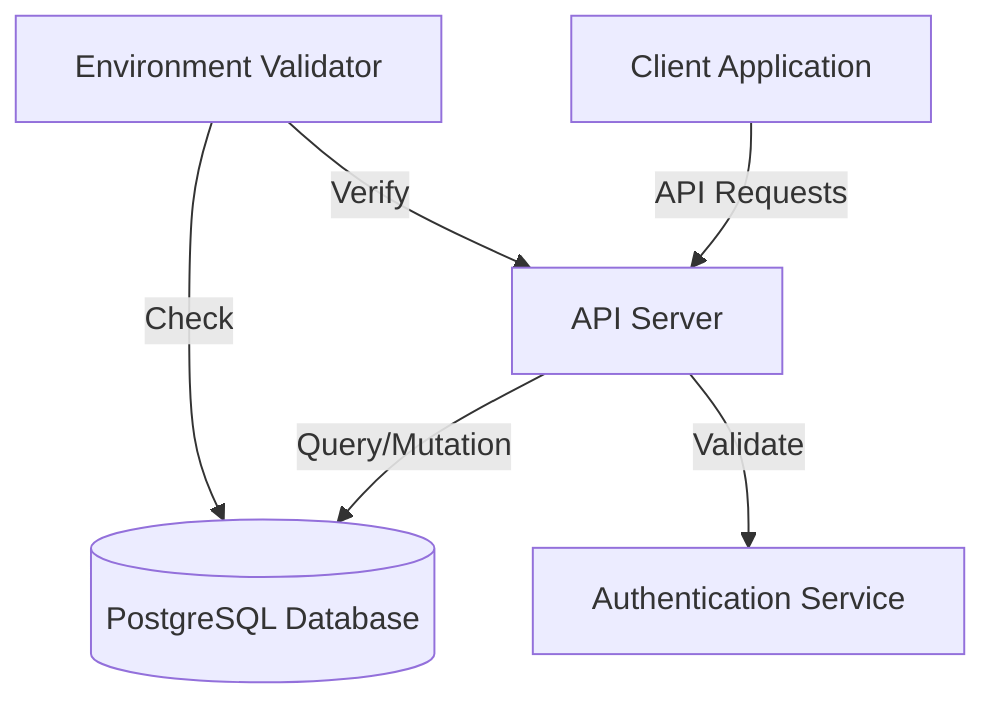
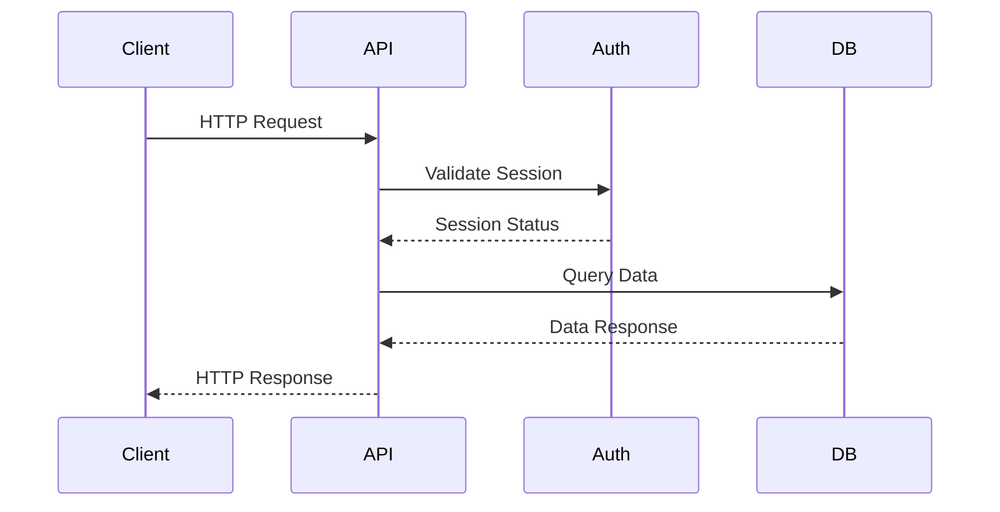
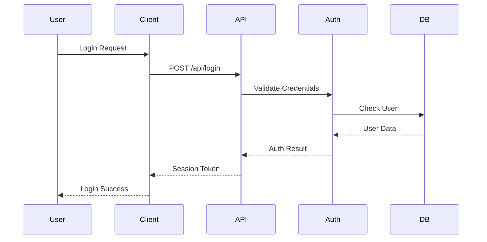
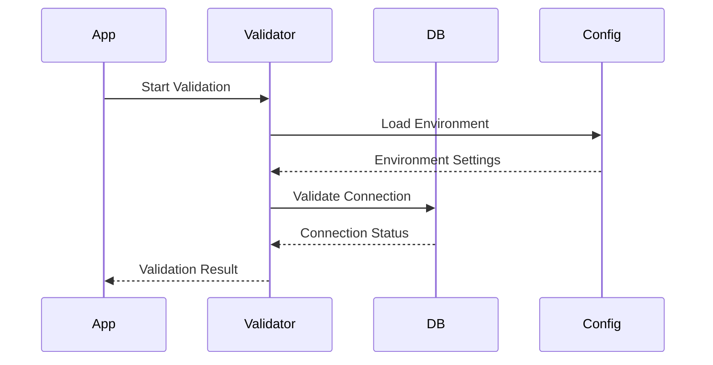

# Component Interaction Documentation

## System Components and Their Interactions

### Overview Diagram

## Component Communication Flows

### 1. Client-Server Communication

### 2. Authentication Flow

### 3. Environment Configuration Flow

## Component Responsibilities

### Client Application
- User interface rendering
- State management
- Form handling
- API communication
- Route management

### API Server
- Request handling
- Authentication
- Data validation
- Database operations
- Error handling

### Database Layer
- Data persistence
- Schema management
- Query optimization
- Connection pooling

### Authentication Service
- User authentication
- Session management
- Access control
- Security validation

### Environment Validator
- Configuration validation
- Environment detection
- Connection verification
- Security checks

## Communication Patterns

### REST API Communication
- Standard HTTP methods
- JSON payloads
- Status code responses
- Error handling

### Database Interactions
- ORM queries
- Transaction management
- Connection pooling
- Error handling

### Event-Based Communication
- Session events
- Validation events
- Error events
- State changes

## Security Considerations

### Request Validation
1. Authentication check
2. Session validation
3. Input sanitization
4. Permission verification

### Data Protection
1. SSL/TLS encryption
2. Secure cookies
3. Environment isolation
4. Data validation

## Error Handling

### Client-Side Errors
- Network errors
- Validation errors
- Authentication errors
- State management errors

### Server-Side Errors
- Database errors
- Authentication failures
- Validation errors
- Environment errors

## Cross-Environment Considerations

### Development Environment
- Local database connections
- Development SSL settings
- Debug logging
- Hot reloading

### Production Environment
- Managed database
- Strict SSL requirements
- Production logging
- Optimized builds

## References
- [System Architecture](./system-architecture.md)
- [API Documentation](/api-docs)
- [Workflow Guide](./workflow.md)
