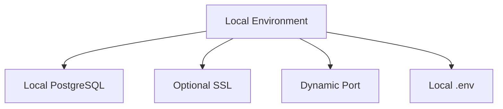
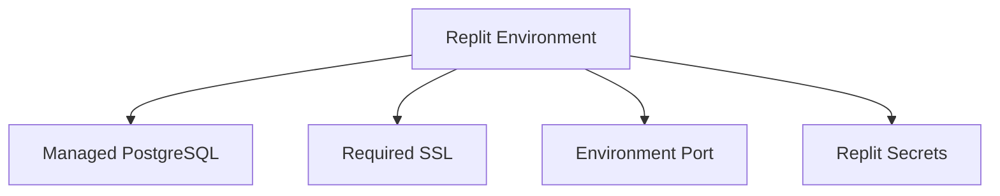

# Environment-Specific Configurations

## Overview

The TEN platform implements a robust environment-aware configuration system that automatically adapts to different deployment contexts. This document details the configuration patterns and implementations across different environments.

## Environment Types

### Local Development (Windsurf)


#### Configuration Details
- Database: Local PostgreSQL instance
- SSL: Optional for development
- Port Configuration: Dynamic allocation
- Environment Variables: Local .env file
- CORS: Permissive for development

### Cloud Development (Replit)


#### Configuration Details
- Database: Managed PostgreSQL service
- SSL: Required for production
- Port Configuration: Environment-managed
- Environment Variables: Replit Secrets
- CORS: Strict production settings

## Configuration Components

### 1. Environment Detection
```typescript
// Environment detection mechanism
const isReplit = process.env.REPL_ID !== undefined;
const isDevelopment = process.env.NODE_ENV !== 'production';
```

### 2. Database Configuration
- Connection Pool Management
- SSL Requirements
- Automatic Reconnection
- Error Handling

### 3. Server Configuration
- Port Management
- CORS Settings
- SSL/TLS Setup
- Static File Serving

### 4. Frontend Configuration
- API Endpoint Management
- Environment Variables
- Build Optimization
- Asset Handling

## Validation System

### Environment Validators
1. Database Validator
   - Connection verification
   - SSL compliance
   - Pool configuration
   - Performance metrics

2. Server Validator
   - Port availability
   - SSL certificate verification
   - CORS configuration
   - Resource allocation

3. Application Validator
   - Environment variables
   - Dependencies
   - Build configuration
   - Runtime settings

## Cross-Environment Synchronization

### Database Synchronization
- Schema version control
- Migration management
- Data consistency checks
- Backup procedures

### Configuration Synchronization
- Environment variable management
- Secret management
- Configuration file synchronization
- Deployment settings

## Security Considerations

### Development Environment
- Relaxed security for rapid development
- Local SSL optional
- Debug logging enabled
- Development-specific features

### Production Environment
- Strict security policies
- Required SSL/TLS
- Limited logging
- Performance optimization

## Configuration Management Best Practices

### 1. Environment Variables
- Use .env for local development
- Use Replit Secrets for cloud deployment
- Never commit sensitive data
- Validate all required variables

### 2. Database Configuration
- Use connection pooling
- Implement retry mechanisms
- Monitor connection health
- Handle failures gracefully

### 3. Security Settings
- Environment-specific SSL
- Proper CORS configuration
- Secure session management
- Error handling policies

### 4. Deployment Configuration
- Environment detection
- Automatic adaptation
- Validation checks
- Failure recovery

## Troubleshooting Guide

### Common Issues
1. Database Connection Failures
   - Check credentials
   - Verify network connectivity
   - Validate SSL settings
   - Review connection limits

2. Environment Configuration Errors
   - Validate environment variables
   - Check configuration files
   - Verify deployment settings
   - Review log files

3. Cross-Environment Sync Issues
   - Check schema versions
   - Verify data consistency
   - Review migration status
   - Validate configuration sync

## References
- [System Architecture Overview](./system-architecture.md)
- [Component Interactions](./component-interactions.md)
- [Workflow Documentation](./workflow.md)
