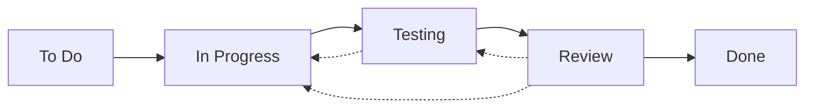

# Jira Task Workflow

## Status Flow


## Status Definitions

### 1. To Do
- Initial state for all new tasks
- Task is defined but work has not started
- Requirements and acceptance criteria are documented

### 2. In Progress
- Active development work is ongoing
- Task is assigned to a developer
- Regular updates are being made

### 3. Testing
- Development work is complete
- Tests are being written and executed
- Integration testing in progress
- QA verification ongoing

### 4. Review
- All tests are passing
- Code is ready for peer review
- Required documentation is in place
- Work log has been updated

### 5. Done
- All acceptance criteria met
- Code review completed
- All tests passing
- Documentation finalized
- Work log verified

## Transition Requirements

### To Do → In Progress
- Task is properly defined
- Acceptance criteria are clear
- Dependencies are resolved
- Resources are available

### In Progress → Testing
**Required Actions:**
1. Code Changes:
   - All development work completed
   - Code follows style guidelines
   - Basic functionality verified

2. Testing Requirements:
   - Unit tests written
   - Integration tests planned
   - Test cases documented
   - Test data prepared

3. Work Log:
   - Development activities documented
   - Implementation decisions recorded
   - Time tracking updated

### Testing → Review
**Required Actions:**
1. Test Coverage:
   - Unit tests implemented and passing
   - Integration tests completed
   - Edge cases covered
   - Performance tests executed if needed

2. Testing Documentation:
   - Test cases documented
   - Test results recorded
   - Coverage reports generated
   - Known limitations documented

3. QA Verification:
   - Functionality verified
   - Edge cases tested
   - UI/UX requirements met
   - Performance requirements met

4. Work Log:
   - Testing activities documented
   - Test results summarized
   - Issues found and resolved

### Review → Done
**Verification Points:**
1. Code Review:
   - Code quality meets standards
   - Tests are comprehensive
   - No security issues
   - Performance considerations addressed

2. Test Review:
   - Test coverage is sufficient
   - All tests are passing
   - Edge cases are covered
   - Performance meets requirements

3. Documentation Review:
   - Documentation is clear and complete
   - API documentation is accurate
   - Test documentation is complete
   - Work log is properly documented

4. Final Checks:
   - All comments addressed
   - CI/CD pipeline passing
   - No merge conflicts
   - Version numbers updated if needed

### Review → Testing
- Additional test cases needed
- Test coverage insufficient
- New edge cases identified
- Performance issues found

### Review → In Progress
- Issues found during review
- Additional work required
- New requirements identified

## Work Log Template
```markdown
Work Log for [Task Name] ([Date]):

Activity:
1. [Major Activity Category]:
   - [Specific action taken]
   - [Another specific action]
   - [Results or outcomes]

2. Testing Activities:
   - [Tests implemented]
   - [Test coverage]
   - [Test results]
   - [Issues found and resolved]

3. [Another Activity Category]:
   - [Details of work done]
   - [Changes made]
   - [Impact of changes]

Comments:
- [Important observations]
- [Decisions made]
- [Challenges faced]

Review Checklist:
☐ [Specific requirement]
☐ Tests implemented and passing
☐ Test coverage sufficient
☐ [Another requirement]
☐ [Final requirement]

Next Steps:
- [Future action item]
- [Another action item]
```

## Best Practices

### 1. Regular Updates
- Update work log daily
- Keep status current
- Document blockers immediately

### 2. Testing Standards
- Write tests during development
- Maintain high test coverage
- Document test cases clearly
- Include performance tests
- Test edge cases thoroughly

### 3. Clear Communication
- Use comments for important decisions
- Link related issues
- Mention dependencies

### 4. Quality Control
- Follow review checklist
- Document all changes
- Update related documentation
- Verify test coverage

### 5. Time Tracking
- Log time accurately
- Include testing time
- Include planning time
- Document meeting time

## Scripts and Automation
Location: `/scripts/jira/`

Available Scripts:
- `move_to_progress.py`: Move task to "In Progress"
- `move_to_testing.py`: Move task to "Testing"
- `move_to_review.py`: Move task to "Review"
- `move_to_done.py`: Move task to "Done"
- `add_comment.py`: Add comments or work logs
- `create_task.py`: Create new tasks
