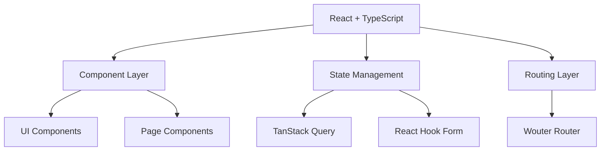
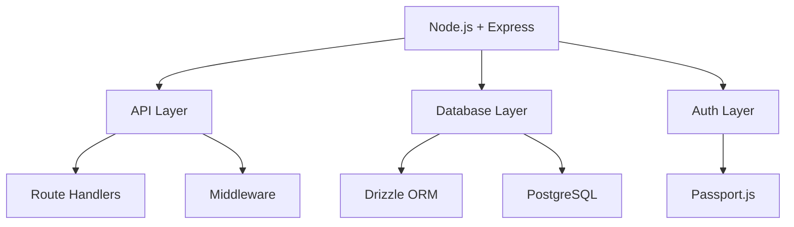

# Technical Implementation Details

## Architecture Overview

### Frontend Architecture


### Backend Architecture


## Implementation Details

### Frontend Implementation

#### 1. Component Structure
- Atomic Design Pattern
- Shadcn UI Components
- Custom Hooks
- Responsive Design

#### 2. State Management
```typescript
// Example of TanStack Query implementation
const { data, isLoading, error } = useQuery({
  queryKey: ['key'],
  queryFn: fetchData,
  staleTime: 5000,
});
```

#### 3. Form Handling
```typescript
// React Hook Form with Zod validation
const form = useForm<FormData>({
  resolver: zodResolver(schema),
  defaultValues: {},
});
```

#### 4. Routing Implementation
```typescript
// Wouter routing setup
<Switch>
  <Route path="/" component={Home}/>
  <Route path="/dashboard" component={Dashboard}/>
</Switch>
```

### Backend Implementation

#### 1. API Structure
```typescript
// Route handler pattern
app.get('/api/resource', async (req, res) => {
  try {
    // Implementation
  } catch (error) {
    // Error handling
  }
});
```

#### 2. Database Access
```typescript
// Drizzle ORM patterns
const result = await db
  .select()
  .from(table)
  .where(eq(table.id, id));
```

#### 3. Authentication Flow
```typescript
// Passport.js implementation
passport.use(new LocalStrategy(
  async (username, password, done) => {
    // Authentication logic
  }
));
```

#### 4. Error Handling
```typescript
// Global error handler
app.use((error, req, res, next) => {
  // Error handling logic
});
```

## Database Implementation

### 1. Schema Design
```typescript
// Drizzle schema definition
export const users = pgTable('users', {
  id: serial('id').primaryKey(),
  username: text('username').notNull(),
  // Additional fields
});
```

### 2. Migration Management
- Drizzle Migration System
- Version Control
- Rollback Procedures
- Data Integrity

### 3. Query Optimization
- Index Management
- Query Planning
- Performance Monitoring
- Cache Strategy

## Security Implementation

### 1. Authentication
- Session Management
- Password Hashing
- Token Validation
- Rate Limiting

### 2. Authorization
- Role-Based Access
- Permission System
- Route Protection
- Data Access Control

### 3. Data Protection
- Input Validation
- Output Sanitization
- SQL Injection Prevention
- XSS Protection

## Testing Strategy

### 1. Unit Testing
- Component Tests
- Service Tests
- Utility Tests
- Mock Implementations

### 2. Integration Testing
- API Testing
- Database Testing
- Authentication Testing
- End-to-End Flows

## Deployment Implementation

### 1. Build Process
- Asset Optimization
- Code Minification
- Bundle Analysis
- Source Maps

### 2. Environment Setup
- Configuration Loading
- Secret Management
- Service Integration
- Health Checks

## Performance Optimization

### 1. Frontend Optimization
- Code Splitting
- Lazy Loading
- Cache Strategy
- Bundle Size Management

### 2. Backend Optimization
- Query Optimization
- Connection Pooling
- Response Caching
- Resource Management

## Monitoring and Logging

### 1. Error Tracking
- Error Capture
- Stack Trace Analysis
- User Context
- Error Reporting

### 2. Performance Monitoring
- Response Times
- Resource Usage
- Query Performance
- Client Metrics

## References
- [Environment Configurations](./environment-configurations.md)
- [Component Interactions](./component-interactions.md)
- [API Documentation](/api-docs)
